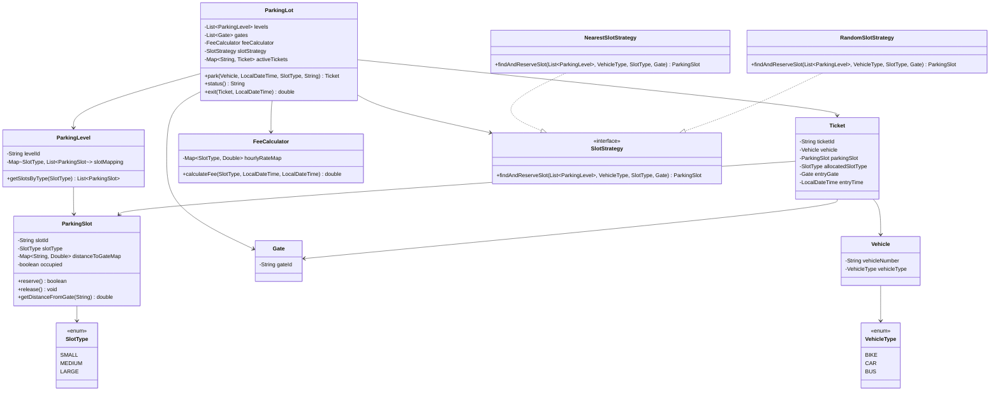

# Parking Lot — LLD

A multilevel parking lot system with multiple gates. It assigns the nearest compatible slot, generates tickets, and calculates fees by **allocated slot type**.

## Features
- **Slot types**: Small, Medium, Large
- **Nearest slot allocation** from the entry gate
- **Larger-slot fallback**:
  - Bike → Small / Medium / Large
  - Car → Medium / Large
  - Bus → Large only
- **Billing by allocated slot type**
- **Multiple gates** with per-slot distance mapping
- **Ticket tracking** with vehicle, slot, slot type, gate, and entry time

## Design Patterns
- **Singleton**: `ParkingLot`
- **Strategy**: `SlotStrategy`
  - `NearestSlotStrategy`
  - `RandomSlotStrategy`

## Mermaid UML


## Main Classes
- `ParkingLot` → main APIs: `park`, `status`, `exit`
- `ParkingLevel` → one floor of slots
- `ParkingSlot` → one slot with type, occupancy, and gate distances
- `Gate` → entry/exit point
- `Vehicle` → vehicle details
- `Ticket` → parking record
- `FeeCalculator` → computes bill
- `SlotStrategy` → slot allocation rule

## API
```java
Ticket ticket = parkingLot.park(vehicle, entryTime, requestedSlotType, entryGateId);
String availability = parkingLot.status();
double fee = parkingLot.exit(ticket, exitTime);
```

## Run
```bash
cd ParkingLot
javac *.java
java Main
```
