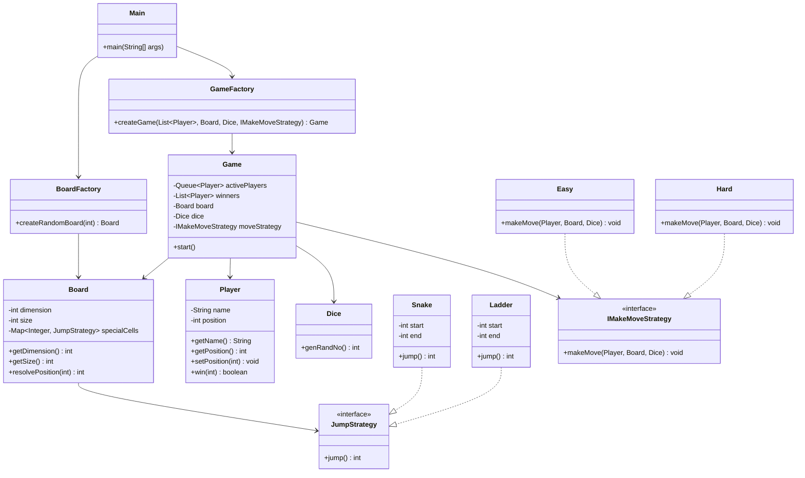

# Snakes & Ladders — LLD

A simple turn-based **Snakes and Ladders** game on a random `n × n` board.
The board has exactly **n snakes** and **n ladders**, placed without creating cycles.
Players roll a dice, move in turns, and must land **exactly** on the last cell to win.

## Features

- User input for:
  - board dimension `n`
  - number of players
  - difficulty: `easy` / `hard`
- Board size = `n²`
- Exactly `n` snakes and `n` ladders
- No jump cycles
- Queue-based turn handling
- Exact win condition
- Strategy pattern for difficulty
- Factory pattern for board and game creation

## Main Classes

- `Main` → takes input and starts the game
- `Game` → controls turns and winners
- `Board` → stores board size and snakes/ladders
- `BoardFactory` → creates random valid board
- `GameFactory` → creates `Game`
- `Player` → stores name and position
- `Dice` → rolls `1` to `6`
- `Snake`, `Ladder` → special jumps
- `IMakeMoveStrategy` → move rule interface
- `Easy`, `Hard` → difficulty strategies
- `JumpStrategy` → common interface for snake/ladder

## Mermaid UML Diagram



## Run

```bash
javac *.java
java Main
```

## Example Input

```text
Enter board dimension n (board will be n x n): 5
Enter number of players: 2
Enter difficulty level (easy/hard): easy
```

## Notes

- Players start at `0`
- A player wins only by reaching exactly `n²`
- Overshooting does not move the player
- Winners are ranked in order
