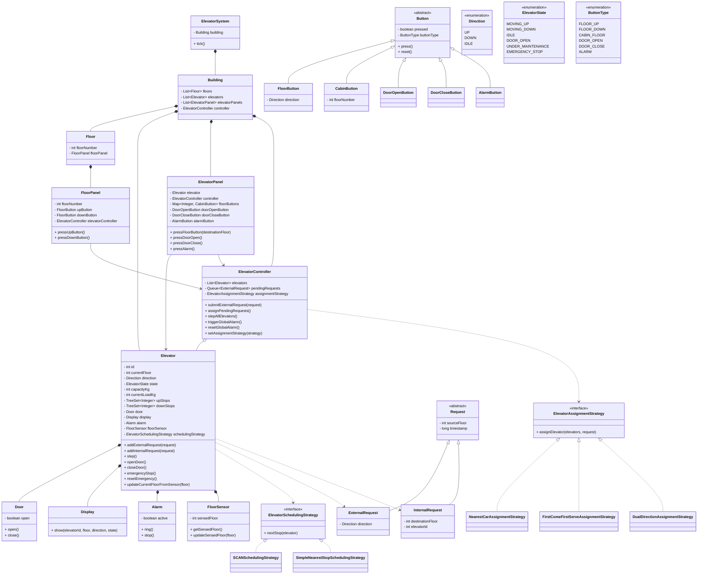

# Elevator System

This project is a **Low Level Design (LLD)** of a **multiple elevator system**.

It supports:
- Multiple elevators
- Only **2 outside buttons** on each floor: **UP** and **DOWN**
- Separate inside panel for each elevator
- Inside panel buttons for:
  - destination floors
  - open door
  - close door
  - alarm
- Different elevator assignment strategies
- Different elevator scheduling strategies
- Global alarm handling
- Sensor-based current floor updates

---

## Main Idea

When a user presses an outside floor button, an **external request** is created.

The **ElevatorController** receives the request and uses an **assignment strategy** to select one elevator.

After that, the selected elevator uses its own **scheduling strategy** to decide the stop order.

This keeps:
- **assignment logic separate**
- **movement logic separate**

So different algorithms can be added easily.

---

## Features

- Multiple elevator cars
- Outside floor panel with only **UP** and **DOWN**
- Inside elevator panel with:
  - floor buttons
  - door open button
  - door close button
  - alarm button
- Assignment strategy can be changed
- Scheduling strategy can be changed
- Alarm stops all elevators
- Maintenance / emergency state support
- Sensor abstraction for current floor

---

## Important Design Points

### 1. Elevator assignment is separate
The controller does not directly decide which elevator should take the request.

That logic is handled by:

- `ElevatorAssignmentStrategy`

Examples:
- `NearestCarAssignmentStrategy`
- `FirstComeFirstServeAssignmentStrategy`
- `DualDirectionAssignmentStrategy`

### 2. Elevator stop order is separate
Once an elevator is assigned, that elevator decides its next stop using:

- `ElevatorSchedulingStrategy`

Examples:
- `SCANSchedulingStrategy`
- `SimpleNearestStopSchedulingStrategy`

### 3. Controller only coordinates
`ElevatorController`:
- receives external requests
- asks strategy to choose an elevator
- steps all elevators
- handles global alarm

### 4. Elevator manages its own movement
Each `Elevator` manages:
- current floor
- direction
- state
- pending stops
- door operations
- alarm state
- sensor updates

---

## Request Flow

### Outside button press
1. User presses **UP** or **DOWN** on a floor
2. `FloorPanel` creates an `ExternalRequest`
3. `ElevatorController` receives it
4. Assignment strategy selects one elevator
5. That elevator adds the request
6. Elevator moves and serves the floor

### Inside button press
1. User presses a destination floor inside elevator
2. `ElevatorPanel` creates an `InternalRequest`
3. Elevator adds destination stop
4. Scheduling strategy decides stop order
5. Elevator moves

### Alarm button press
1. User presses alarm button inside an elevator
2. Controller triggers global alarm
3. All elevators stop
4. Alarm rings

---

## Project Files

- `Main.java`  
  Entry point to run the program

- `Building.java`  
  Creates floors, elevators, panels, and controller

- `ElevatorSystem.java`  
  Runs the system using `tick()`

- `Elevator.java`  
  Core class for one elevator

- `ElevatorController.java`  
  Coordinates external requests and global operations

- `Floor.java`  
  Represents one floor

- `FloorPanel.java`  
  Outside panel with UP and DOWN buttons

- `ElevatorPanel.java`  
  Inside panel with floor/open/close/alarm buttons

- `Request.java`  
  Base request class

- `ExternalRequest.java`  
  Request from floor panel

- `InternalRequest.java`  
  Request from elevator panel

- `Direction.java`  
  Defines `UP`, `DOWN`, `IDLE`

- `ElevatorState.java`  
  Defines states like moving, idle, emergency stop

- `Button.java` and button subclasses  
  Represents different button types

- `Door.java`, `Display.java`, `Alarm.java`, `FloorSensor.java`  
  Supporting device classes

- Strategy classes  
  Used for assignment and scheduling algorithms

---

## How to Run

Compile all files:

```bash
javac *.java
```

Run the program:

```bash
java Main
```

---

## Mermaid UML Diagram



---

## Conclusion

This project shows a clean object-oriented design for a multiple elevator system.

It separates:
- request assignment
- elevator movement logic
- buttons and panels
- supporting devices

This makes the design easier to understand and easy to extend in future.
