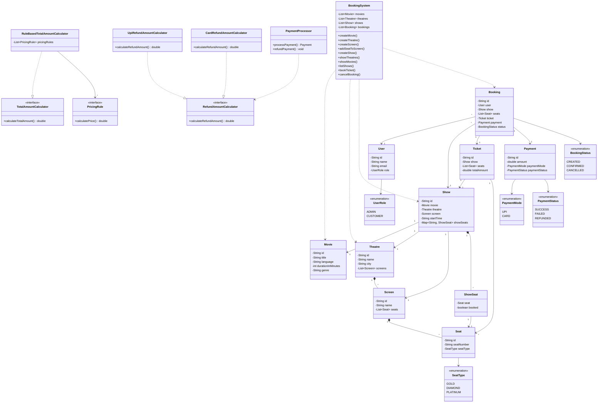

# Movie Ticket Booking System

This is a simple Java project for a **movie ticket booking system**.

## What this project does

The system allows:

- admin to add movies
- admin to add theatres
- admin to create shows
- customer to view theatres in a city
- customer to view movies in a city
- customer to see available shows
- customer to book seats
- customer to cancel booking
- system to process payment
- system to calculate refund on cancellation

## Main idea

A movie runs in a theatre.

A theatre has screens.

A screen has seats.

A show is created for one movie on one screen at a particular time.

When a customer books seats for a show:

- selected seats are checked
- total amount is calculated
- payment is processed
- ticket and booking are created

When a customer cancels:

- booking status changes
- seats become available again
- refund amount is calculated

## Important points used in this design

- `User` has a role: `ADMIN` or `CUSTOMER`
- no extra display strategy interface is used
- admin actions are handled directly by `BookingSystem`
- one seat cannot be booked twice for the same show
- different seat types can have different prices
- simple rule-based pricing is used
- UPI and Card payment modes are supported

## Main files

### Core classes
- `User.java`
- `Movie.java`
- `Theatre.java`
- `Screen.java`
- `Seat.java`
- `Show.java`
- `ShowSeat.java`
- `Ticket.java`
- `Booking.java`
- `Payment.java`

### Enums
- `UserRole.java`
- `SeatType.java`
- `PaymentMode.java`
- `BookingStatus.java`
- `PaymentStatus.java`

### Service / logic classes
- `BookingSystem.java`
- `PricingRule.java`
- `RuleBasedTotalAmountCalculator.java`
- `PaymentProcessor.java`
- `RefundAmountCalculator.java`
- `UpiRefundAmountCalculator.java`
- `CardRefundAmountCalculator.java`

### Entry point
- `Main.java`

## Class relationships in simple words

- `Theatre` contains screens
- `Screen` contains seats
- `Show` is linked to one movie, one theatre, and one screen
- `ShowSeat` stores seat status for a particular show
- `Booking` stores booked seats and payment details
- `Ticket` is generated after successful booking

## How pricing works

Each seat has a type, such as:

- GOLD
- DIAMOND
- PLATINUM

Each seat type can have a different base price.

A pricing rule can increase the amount based on conditions like demand or day.

This project keeps pricing simple and readable.

## How booking works

1. customer selects city, movie, show, and seats
2. system checks whether seats are available
3. system calculates total amount
4. payment is processed
5. booking is confirmed
6. ticket is generated

## How cancellation works

1. customer cancels the booking
2. booking status becomes cancelled
3. seats are released
4. refund amount is calculated
5. refund is processed based on payment mode

## UML Class Diagram



## How to compile

Open terminal in the project folder and run:

```bash
javac *.java
```

## How to run

```bash
java Main
```

## Why this design is simple

This version is kept simple for student understanding:

- all files are in one folder
- no package structure
- code is easy to compile
- code is easy to understand
- admin functions are handled in one main system class

## Note

In a real-world production system, we would also add:

- database
- concurrency handling / seat locking
- login/authentication
- APIs
- better exception handling
- payment gateway integration
- notifications by email or SMS
