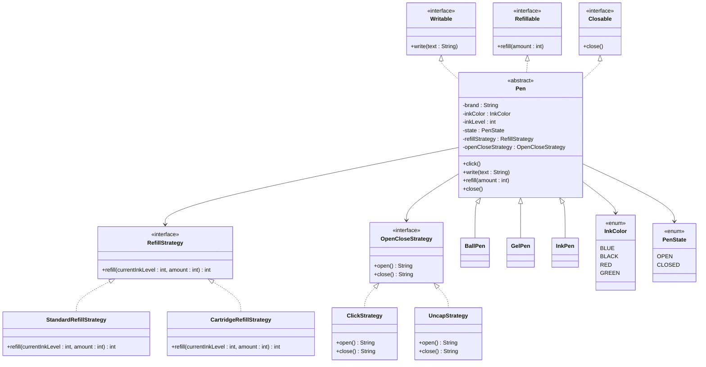

# Pen Design — LLD

A simple pen design that supports:

- `click()`
- `write(String text)`
- `refill(int amount)`
- `close()`

Different pen behaviours are handled using the **Strategy Pattern**.

---

## Design

### Strategy Pattern
- **RefillStrategy**
  - `StandardRefillStrategy`
  - `CartridgeRefillStrategy`

- **OpenCloseStrategy**
  - `ClickStrategy`
  - `UncapStrategy`

### Inheritance
- `Pen` is the abstract base class
- `BallPen`
- `GelPen`
- `InkPen`

---

## Pen Types

- **BallPen** → Click + Standard refill  
- **GelPen** → Click + Cartridge refill  
- **InkPen** → Uncap + Standard refill  

---

## UML Diagram



---

## Project Structure

```text
pen-design/
├── README.md
└── src/
    ├── Main.java
    ├── Pen.java
    ├── BallPen.java
    ├── GelPen.java
    ├── InkPen.java
    ├── Writable.java
    ├── Refillable.java
    ├── Closable.java
    ├── RefillStrategy.java
    ├── StandardRefillStrategy.java
    ├── CartridgeRefillStrategy.java
    ├── OpenCloseStrategy.java
    ├── ClickStrategy.java
    ├── UncapStrategy.java
    ├── InkColor.java
    └── PenState.java
```

---

## Compile and Run

```bash
cd pen-design/src
javac *.java
java Main
```

---

## Sample Output

```text
=== Ball Pen (click + standard refill) ===
Click! Pen tip extended.
Writing: Hello from a ball pen!
Ink remaining: 65%
Refilled by 25%. Ink level: 90%
Click! Pen tip retracted.
```

---

## Key Point

This design is flexible because new pen mechanisms can be added by creating a new strategy class, without changing the main `Pen` logic.
